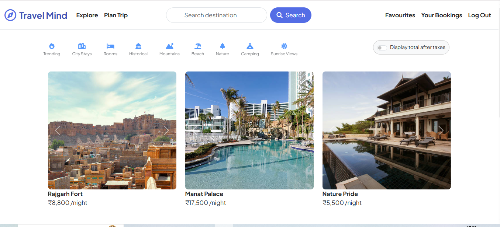
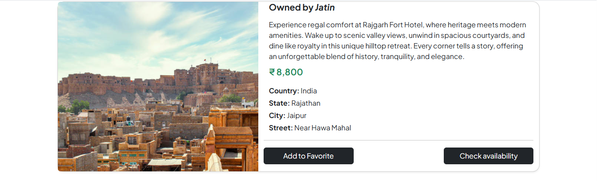
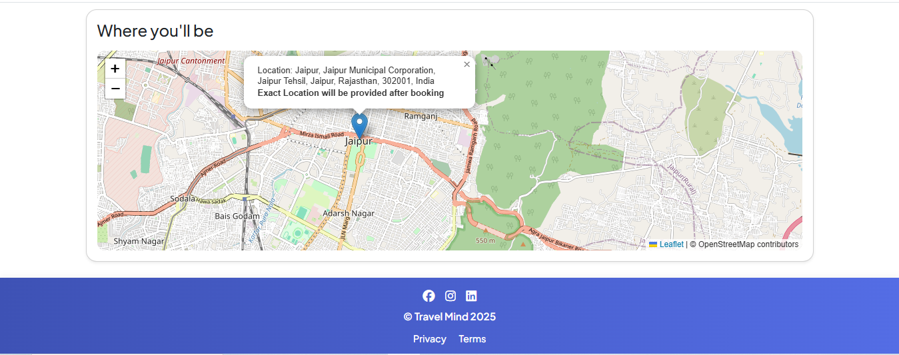
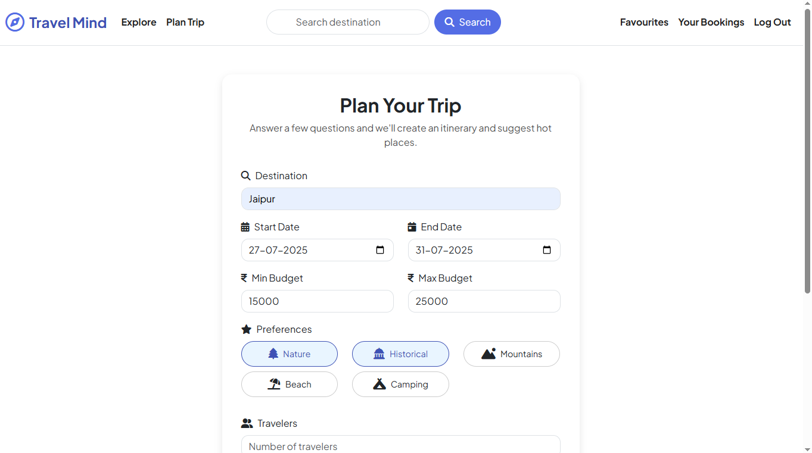
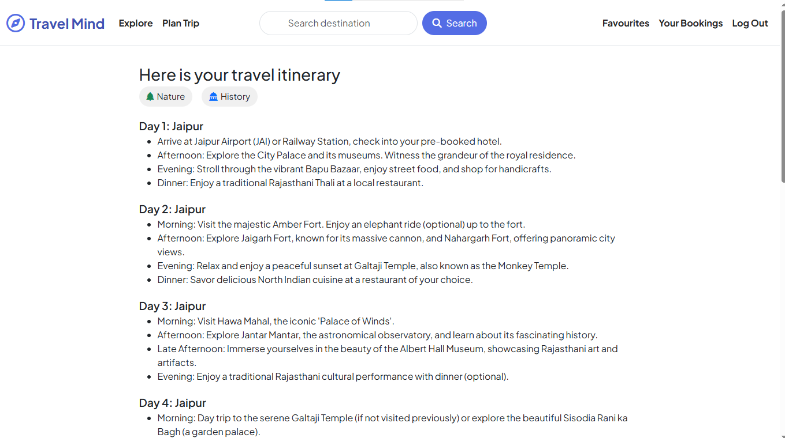
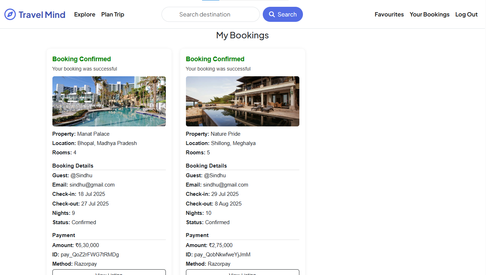

# TravelMind

TravelMind is a web-based platform designed to simplify travel planning, booking, and exploration. Users can search for destinations, browse property listings, plan trips with AI-powered itineraries, and complete bookings with secure payments.

With features like Google login, real-time availability checks, interactive maps, and a personalized dashboard for both travelers and property owners, TravelMind creates a seamless travel experience from start to finish.

---

##  Live Demo

The TravelWorld application is fully deployed and accessible online. Click below to explore listings, plan your trip, and generate itineraries:

**Live Site (Render):** [Visit TravelWorld](https://travelmind-z00u.onrender.com)

---

## Features

- **User Authentication:** Sign up using email or Google account (via Firebase).
- **Traveler and Owner Dashboards:** Separate experiences for travelers and property owners.
- **Property Listings:** Browse, create, edit, and delete hotel/property listings with rich details and images.
- **Search Functionality:** Search listings by destination with live search support.
- **Trip Planning:** AI-powered itinerary generation using Gemini based on budget, preferences, and travel dates.
- **Interactive Map View:** View listing locations on a dynamic Leaflet.js + OpenStreetMap integration.
- **Booking System:** Check availability, select dates and rooms, and pay token money using Razorpay integration.
- **Favorites Management:** Add and remove listings from your favorites with one click.
- **Review System:** Leave and view reviews for properties with star ratings.
- **Responsive UI:** Mobile-friendly, clean design with themed navigation and modals.
- **Access Control:** Owners cannot book their own properties; only travelers can initiate bookings.


---

## Tech Stack

**Frontend:**
- EJS (Embedded JavaScript Templates)
- Bootstrap 5
- JavaScript
- HTML
- CSS

**Backend:**
- Node.js
- Express.js
- MongoDB with Mongoose
- Cloudinary (Image Upload and Management)

---

## Screenshots

### 1. Home Page – Explore Listings


### 2. Listing Details with Map & Booking



### 3. Plan Your Trip Form


### 4. AI-Generated Itinerary PDF


### 5.Bookings Page  


---

## How to Run Locally

1. First, clone the repository to your machine using `git clone`.
2. Go into the root folder and open a terminal window.
3. Run `npm install` to install all dependencies.
4. Start the application by running `node app.js` or `nodemon app.js` if you have Nodemon installed.
5. Open your browser and visit `http://localhost:8080` to use the application locally.

Make sure MongoDB is running locally or adjust the connection string to your cloud instance (like MongoDB Atlas) if you're using one.

---

###  Environment Setup

Before running the app, make sure you create the following environment file:

#### `.env`

```env
ATLASDB_URL=your_mongodb_connection_string
SECRET=your_session_secret
CLOUD_NAME=your_cloudinary_cloud_name
CLOUD_API_KEY=your_cloudinary_api_key
CLOUD_API_SECRET=your_cloudinary_api_secret
RAZORPAY_KEY_ID=your_razorpay_key_id
RAZORPAY_KEY_SECRET=your_razorpay_key_secret
GEMINI_API_KEY=your_gemini_api_key
```
##  Contact

Feel free to connect if you have any questions or feedback:

- **Email:** bhatiajatin974@gmail.com
- **LinkedIn:** [Jatin Bhatia](https://www.linkedin.com/in/jatin-bhatia-4653042aa/)